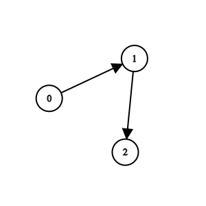

## 2924. Find Champion II

There are n teams numbered from 0 to n - 1 in a tournament; each team is also a node in a DAG.

You are given the integer n and a 0-indexed 2D integer array edges of length m representing the DAG, where edges[i] = [ui, vi] indicates that there is a directed edge from team ui to team vi in the graph.

A directed edge from a to b in the graph means that team a is stronger than team b and team b is weaker than team a.

Team a will be the champion of the tournament if there is no team b that is stronger than team a.

Return the team that will be the champion of the tournament if there is a unique champion, otherwise, return -1.

Notes

A cycle is a series of nodes a1, a2, ..., an, an+1 such that node a1 is the same node as node an+1, the nodes a1, a2, ..., an are distinct, and there is a directed edge from the node ai to node ai+1 for every i in the range [1, n].
A DAG is a directed graph that does not have any cycle.
 

Example 1:

Input: n = 3, edges = [[0,1],[1,2]]
Output: 0
Explanation: Team 1 is weaker than team 0. Team 2 is weaker than team 1. So the champion is team 0.
Example 2:

Input: n = 4, edges = [[0,2],[1,3],[1,2]]
Output: -1
Explanation: Team 2 is weaker than team 0 and team 1. Team 3 is weaker than team 1. But team 1 and team 0 are not weaker than any other teams. So the answer is -1.

## Solution ##

/**
time: O(n + e)
space: O(n)
 */
 
var findChampion = function(n, edges) {
     // Create an array to track if a team is "undefeated" (true by default for all teams)
    const isUndefeated = new Array(n).fill(true);

    // Iterate over each edge to mark teams that are defeated
    for(const [winner, loser] of edges){
        // If a team is a loser in any edge, mark it as defeated
        isUndefeated[loser] = false;
    }

    // Initialize variables to track the champion and count of undefeated teams
    let champion = -1; // Default to -1 (no champion found)
    let championCount = 0; // Number of undefeated teams

    // Iterate over all teams to find the undefeated ones
    for(let team = 0; team < n; team++){
        if(isUndefeated[team]){
            // If the team is undefeated, mark it as the potential champion
            champion = team;
            // Increment the count of undefeated teams
            championCount++;
        }
    }

    // If there is exactly one undefeated team, return it as the champion
    // Otherwise, return -1 (no unique champion)
    return championCount === 1 ? champion : -1;
    
};